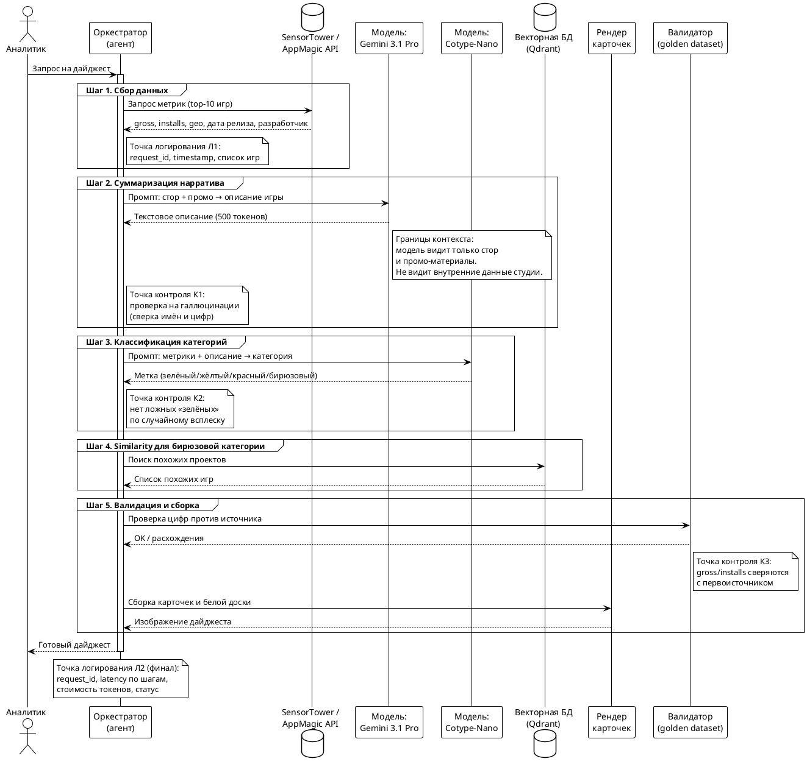

# Дизайн AI-пайплайна

**Роль:** AI Engineer
**Спринт:** Lab2 — Design
**Дата:** 2026-10-01
**Связанные документы:** [research.md](./research.md) (лаба 1), [model-candidates.md](./model-candidates.md)

---

## 1. Общая архитектура

Пайплайн — агентная сборка из четырёх последовательных шагов. Прямые промпты не подходят, потому что задача требует оркестрации (сбор → суммаризация → классификация → сборка). RAG не подходит, потому что нет базы знаний — данные приходят из внешнего API.

Обоснование выбора — в [research.md, раздел «Решение»](./research.md).

### Схема пайплайна (PlantUML)



**Как отрендерить схему:** скопируйте блок между ```plantuml и ``` и вставьте на [plantuml.com/plantuml](https://www.plantuml.com/plantuml/uml/). GitHub умеет рендерить PlantUML, если в репозитории настроен плагин — если нет, схема останется текстом, и это нормально.

---

## 2. Точки контроля качества

| ID | Где | Что проверяем | Что делаем при провале |
|---|---|---|---|
| **К1** | После суммаризации (шаг 2) | Галлюцинации: не путает ли модель игры с похожими названиями, нет ли выдуманных цифр | Отклонить описание, повторить запрос с тем же промптом (retry), при повторном провале — отправить на ручную проверку |
| **К2** | После классификации (шаг 3) | Ложные «зелёные» по случайному всплеску. Сверка категории с историческими данными за 4 недели | Понизить категорию до «жёлтой», пометить для ручной проверки |
| **К3** | Перед публикацией (шаг 5) | Соответствие gross/installs первоисточнику (SensorTower API) | Блокировать публикацию, перезапросить данные, при расхождении >5% — эскалация аналитику |
| **К4** | Финал | Соответствие структуры карточки шаблону (название, платформы, дата, разработчик, описание, график) | Отклонить карточку, пересобрать |

Контроль качества опирается на golden dataset (см. [quality/golden-dataset-plan.md](./quality/golden-dataset-plan.md) — из зоны Quality & Safety).

---

## 3. Точки логирования

| ID | Когда | Что пишем | Зачем |
|---|---|---|---|
| **Л1** | Начало пайплайна | request_id, timestamp, список игр, источник данных | Воспроизводимость прогона |
| **Л2** | Финал пайплайна | request_id, latency по шагам, стоимость токенов, статус (success/fail) | Аудит стоимости и производительности |
| **Л3** | На каждом вызове модели | модель, input_tokens, output_tokens, стоимость, latency | Расчёт бюджета, сравнение с планом |
| **Л4** | При провале контроля качества | ID контроля (К1–К4), причина, что было в input, что вернула модель | Разбор инцидентов |
| **Л5** | При retry | номер попытки, причина повтора, результат | Понимание, где пайплайн нестабилен |

**Формат логов:** JSON-строки, по одной на событие. Пример для Л3:

```json
{
  "request_id": "dg-2026-10-01-001",
  "step": "summarization",
  "model": "gemini-3.1-pro",
  "input_tokens": 2000,
  "output_tokens": 500,
  "cost_usd": 0.010,
  "latency_ms": 2400,
  "timestamp": "2026-10-01T10:15:32Z"
}
```

---

## 4. Границы контекста: что модель видит и чего не видит

### Что модель видит (вход в промпт)

**Для суммаризации (шаг 2):**
- Название игры, разработчик, дата релиза, платформы
- Описание из стора (App Store / Google Play)
- Промо-материалы (трейлер, скриншоты, теги)
- Жанр и механики (из стора)
- Метрики gross/installs (для контекста, не для пересказа)

**Для классификации (шаг 3):**
- Метрики gross/installs и их динамика за 4 недели
- Geo-разбивка установок
- Категория из предыдущего дайджеста (для отслеживания переходов)
- Описание нарратива (из шага 2)

### Что модель НЕ видит

- **Внутренние данные студии:** метрики собственных продуктов, юнит-экономика, retention, LTV — они не нужны для описания чужих игр и создают риск утечки.
- **Персональные данные:** имена аналитиков, комментарии из внутренних чатов, любые PII.
- **Чужие дайджесты и внутренние документы конкурентов** — чтобы не было плагиата и чтобы модель не «додумывала» на основе чужих выводов.
- **Сырые логи и метаданные API** — модели передаётся только очищенный вход, без токенов доступа, URL с параметрами, заголовков.
- **Исторические дайджесты за прошлые периоды** — они используются в К2 для валидации, но не передаются модели, чтобы не смещать её выводы.

### Почему это важно

Границы контекста определяют:
1. **Стоимость** — чем больше вход, тем дороже токены (вход в 2000 токенов на игру даёт $0.100 за дайджест по расчёту).
2. **Качество** — лишний контекст может сбить модель (например, если передать данные по конкурентам, модель может их перепутать).
3. **Безопасность** — PII и внутренние данные не должны покидать студию, даже в промпт.

---

## 5. Что дальше

- **ADR выбора моделей** — финальный выбор из кандидатов лабы 1 + план деградации → [model-candidates.md, раздел «Решение»](./model-candidates.md).
- **Спайки** — проверка самых рискованных допущений этого пайплайна (галлюцинации, стабильность классификации) → [spikes/lab2.md](./spikes/lab2.md).
- **Контракт AI-эндпоинтов** — OpenAPI-спецификация для интеграции с Delivery → [api/openapi.yaml](./api/openapi.yaml).
